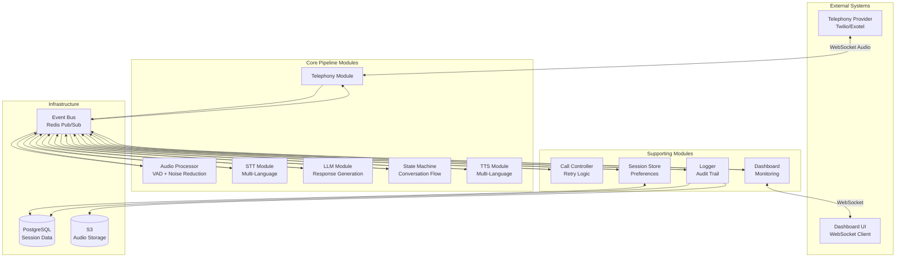
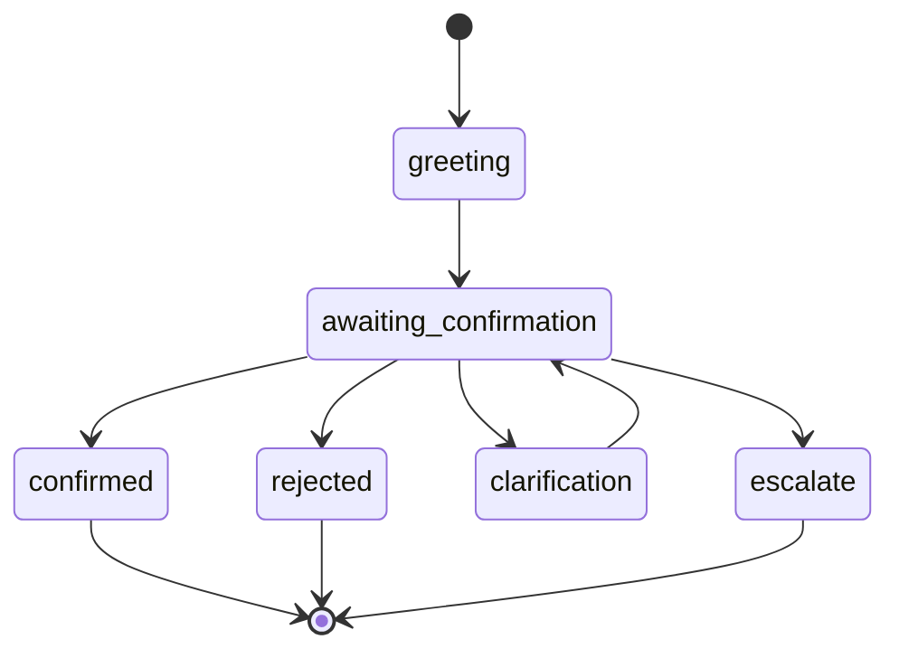

# Design Document: AI Voice Order Confirmation System

## Overview

The AI Voice Order Confirmation System is a real-time, event-driven telephony application designed to conduct natural voice conversations with delivery agents in multiple Indian languages. The system follows a modular pipeline architecture where 10 specialized modules communicate asynchronously through a central event bus, enabling loose coupling, independent scalability, and sub-1.8 second response latency.

### Core Design Principles

1. **Event-Driven Architecture**: All inter-module communication occurs through a central event bus, eliminating direct dependencies
2. **Streaming-First**: Data flows through the pipeline in chunks rather than complete units, minimizing buffering delays
3. **Language Agnostic Pipeline**: The core architecture remains language-independent, with language-specific processing isolated to STT and TTS modules
4. **State Persistence**: Critical state is persisted at key checkpoints to enable recovery from failures
5. **Latency Budget Management**: Each module has a strict latency allocation contributing to the 1.8s total budget

### System Capabilities

- Initiate and receive phone calls through Twilio/Exotel telephony providers
- Process audio in real-time with noise reduction and voice activity detection
- Transcribe speech in 5 Indian languages (Hindi, Tamil, Kannada, Telugu, Marathi)
- Generate contextually appropriate responses using LLM integration
- Synthesize natural-sounding speech in the detected language
- Handle conversation interruptions (barge-in) with <200ms response time
- Track conversation state through deterministic state machine
- Monitor active calls through real-time dashboard
- Retry failed calls with exponential backoff
- Persist user preferences and complete audit trails

## Architecture

### High-Level System Diagram



### Module Pipeline Flow

The system processes a typical conversation turn through this sequence:

1. **Telephony Module** receives audio from phone call → publishes `audio_input` event
2. **Audio Processor** cleans audio, detects speech boundaries → publishes `processed_audio`, `speech_started`, `speech_ended` events
3. **STT Module** transcribes speech → publishes `transcript_partial` and `transcript_final` events
4. **State Machine** updates conversation state based on transcript → publishes `state_update` event
5. **LLM Module** generates response using transcript + state → publishes `llm_response_token` stream
6. **TTS Module** synthesizes speech from tokens → publishes `audio_output` stream
7. **Telephony Module** streams audio back to caller

Supporting modules operate in parallel:
- **Call Controller** monitors state transitions to schedule retries
- **Session Store** loads/saves preferences at call start/end
- **Logger** records all events for audit trail
- **Dashboard** displays real-time updates to operators

### Event Bus Architecture

The event bus serves as the central nervous system, implementing a publish-subscribe pattern with the following characteristics:

**Technology Choice**: Redis Pub/Sub with Redis Streams for guaranteed delivery
- Redis Pub/Sub for real-time, low-latency event distribution
- Redis Streams for events requiring persistence (state transitions, call lifecycle)
- Consumer groups for load balancing across multiple instances of the same module

**Event Routing Strategy**:
- Topic-based routing: each event type maps to a Redis channel
- Wildcard subscriptions for cross-cutting concerns (logging, monitoring)
- Session-based routing: events include `session_id` for correlation

**Delivery Guarantees**:
- At-least-once delivery for critical events (state transitions, call lifecycle)
- Best-effort delivery for streaming events (audio chunks, partial transcripts)
- Event ordering preserved within a single session

### Latency Budget Allocation

Total budget: 1800ms from speech end to audio response start

| Stage | Module | Allocated Time | Cumulative |
|-------|--------|----------------|------------|
| Speech end detection | Audio Processor | 200ms | 200ms |
| Final transcription | STT Module | 400ms | 600ms |
| First token generation | LLM Module | 800ms | 1400ms |
| First audio chunk | TTS Module | 300ms | 1700ms |
| Network + buffer | Telephony Module | 100ms | 1800ms |

**Optimization Strategies**:
- Streaming at every stage to enable parallel processing
- Pre-warming LLM connections to reduce cold start latency
- Caching common TTS phrases to bypass synthesis
- Aggressive VAD tuning to detect speech end quickly
- Regional deployment to minimize network latency

## Components and Interfaces

### 1. Telephony Module

**Responsibility**: Manage phone call lifecycle and bidirectional audio streaming

**Technology Stack**:
- Node.js with Twilio SDK and Exotel SDK
- WebSocket server for audio streaming
- Media stream handling with 20ms audio chunks (320 bytes @ 8kHz μ-law)

**Interface Contract**:

*Consumes*:
- `audio_output` - Audio chunks to stream to caller

*Publishes*:
- `call_initiated` - Call attempt started
- `call_connected` - Call successfully connected
- `call_ended` - Call terminated (with reason: completed, no_answer, dropped, error)
- `audio_input` - Raw audio chunks from caller

**Configuration**:
```typescript
interface TelephonyConfig {
  provider: 'twilio' | 'exotel';
  accountSid: string;
  authToken: string;
  webhookUrl: string;
  audioFormat: 'mulaw' | 'pcm16';
  sampleRate: 8000 | 16000;
}
```

**Key Implementation Details**:
- Maintain WebSocket connection pool for active calls
- Handle provider-specific audio format conversion
- Implement graceful degradation if provider API is slow
- Buffer audio output to smooth playback (max 100ms buffer)

### 2. Audio Processor

**Responsibility**: Clean audio and detect voice activity with minimal latency

**Technology Stack**:
- Python with librosa for audio processing
- WebRTC VAD for voice activity detection
- RNNoise for noise suppression

**Interface Contract**:

*Consumes*:
- `audio_input` - Raw audio chunks from telephony

*Publishes*:
- `processed_audio` - Cleaned audio chunks
- `speech_started` - Speech beginning detected
- `speech_ended` - Speech ending detected (includes duration)
- `barge_in_detected` - User interrupted system speech

**Processing Pipeline**:
1. Noise reduction using RNNoise (10ms per chunk)
2. Volume normalization to -20dB target
3. VAD analysis with 30ms sliding window
4. Barge-in detection by monitoring audio during TTS playback

**VAD Configuration**:
```python
vad_config = {
    'aggressiveness': 3,  # 0-3, higher = more aggressive filtering
    'frame_duration_ms': 30,
    'speech_start_threshold': 0.7,  # Confidence threshold
    'speech_end_silence_ms': 200,  # Silence duration to trigger speech_ended
}
```

### 3. STT Module

**Responsibility**: Transcribe speech to text in multiple Indian languages with streaming support

**Technology Stack**:
- Google Cloud Speech-to-Text API (streaming recognition)
- Language models: hi-IN, ta-IN, kn-IN, te-IN, mr-IN
- Alternative: Azure Speech Services for redundancy

**Interface Contract**:

*Consumes*:
- `processed_audio` - Cleaned audio chunks
- `speech_ended` - Trigger to finalize transcript
- `preferences_loaded` - User's preferred language (if available)

*Publishes*:
- `transcript_partial` - Interim transcription results
- `transcript_final` - Final transcription with language detection and confidence score

**Event Schema**:
```typescript
interface TranscriptFinalEvent {
  session_id: string;
  transcript: string;
  language: 'hi' | 'ta' | 'kn' | 'te' | 'mr';
  confidence: number;  // 0.0 - 1.0
  duration_ms: number;
  timestamp: string;
}
```

**Language Detection Strategy**:
- First utterance: use automatic language detection
- Subsequent utterances: use detected language from first utterance
- Override with stored preference if available
- Fallback to Hindi if detection confidence < 0.6

**Latency Optimization**:
- Maintain persistent gRPC connections to STT API
- Use single_utterance=false for streaming mode
- Set interim_results=true for partial transcripts
- Configure max_alternatives=1 to reduce processing time

### 4. LLM Module

**Responsibility**: Generate contextually appropriate responses based on conversation state

**Technology Stack**:
- OpenAI GPT-4 or Anthropic Claude with streaming API
- LangChain for prompt management and conversation memory
- Redis for conversation context caching

**Interface Contract**:

*Consumes*:
- `transcript_final` - User's speech transcribed
- `state_update` - Current conversation state
- `preferences_loaded` - User history and patterns

*Publishes*:
- `llm_response_token` - Streaming response tokens
- `llm_response_complete` - Response generation finished

**Prompt Architecture**:
```
System Prompt:
- Role: Polite order confirmation agent for Indian delivery service
- Language: Match detected language
- Constraints: Keep responses under 20 words, use "ji" suffix
- Context: Current state, order details, user history

User Message:
- Transcript with detected intent
- Conversation history (last 3 turns)
```

**Context Management**:
- Maintain sliding window of last 3 conversation turns
- Include order details (order_id, items, address, amount)
- Include user metadata (name, past interaction patterns)
- Clear context on state transition to terminal states

**Latency Optimization**:
- Use streaming API to get first token quickly
- Set temperature=0.3 for faster, more deterministic responses
- Limit max_tokens=50 to prevent long responses
- Pre-warm connections during call initialization
- Cache common responses for frequent scenarios

### 5. State Machine

**Responsibility**: Track conversation flow through deterministic state transitions

**Technology Stack**:
- Python with python-statemachine library
- Redis for state persistence

**State Diagram**:


**Interface Contract**:

*Consumes*:
- `call_connected` - Initialize state machine
- `transcript_final` - Analyze for state transition triggers
- `llm_response_complete` - Track conversation progress

*Publishes*:
- `state_update` - State transition occurred

**State Definitions**:

| State | Description | Exit Conditions |
|-------|-------------|-----------------|
| greeting | Initial greeting delivered | Greeting complete |
| awaiting_confirmation | Waiting for yes/no response | Confirmation detected, rejection detected, 3 clarification attempts |
| clarification | Asking for clarification | Clarification provided |
| confirmed | Order confirmed by agent | Terminal state |
| rejected | Order rejected by agent | Terminal state |
| escalate | Cannot resolve, needs human | Terminal state |

**Transition Logic**:
- Intent detection from transcript (keywords + LLM classification)
- Confidence thresholds for state transitions (>0.7 for terminal states)
- Timeout handling (30s in awaiting_confirmation → clarification)
- Max attempts tracking (3 clarifications → escalate)

### 6. TTS Module

**Responsibility**: Synthesize natural speech in detected language with minimal latency

**Technology Stack**:
- Google Cloud Text-to-Speech API (streaming synthesis)
- Pre-rendered audio cache for common phrases
- Voice profiles: Indian-accented voices for each language

**Interface Contract**:

*Consumes*:
- `llm_response_token` - Text tokens to synthesize
- `state_update` - May trigger pre-rendered audio
- `barge_in_detected` - Stop playback immediately

*Publishes*:
- `audio_output` - Synthesized audio chunks
- `tts_playback_started` - Audio playback began
- `tts_playback_stopped` - Audio playback ended

**Voice Selection**:
```typescript
const voiceMap = {
  'hi': 'hi-IN-Wavenet-D',  // Male Hindi voice
  'ta': 'ta-IN-Wavenet-A',  // Female Tamil voice
  'kn': 'kn-IN-Wavenet-A',  // Female Kannada voice
  'te': 'te-IN-Wavenet-B',  // Male Telugu voice
  'mr': 'mr-IN-Wavenet-A',  // Female Marathi voice
};
```

**Caching Strategy**:
- Pre-render common phrases in all 5 languages:
  - Greetings: "Namaste ji", "Vanakkam ji"
  - Confirmations: "Thank you for confirming"
  - Clarifications: "Could you please repeat?"
- Cache key: `{language}:{phrase_hash}`
- Cache hit rate target: >60% of utterances

**Latency Optimization**:
- Use streaming synthesis API
- Request audio in small chunks (0.5s segments)
- Start playback as soon as first chunk available
- Maintain persistent gRPC connections
- Parallel synthesis for multi-sentence responses

### 7. Dashboard Module

**Responsibility**: Provide real-time monitoring interface for active calls

**Technology Stack**:
- React frontend with WebSocket client
- Node.js WebSocket server
- Redis for state aggregation

**Interface Contract**:

*Consumes*:
- `call_connected` - New call to display
- `transcript_final` - Update transcript display
- `state_update` - Update state display
- `call_ended` - Remove call from active list

*Publishes*:
- None (read-only monitoring)

**WebSocket Protocol**:
```typescript
interface DashboardUpdate {
  type: 'call_list' | 'transcript_update' | 'state_update';
  session_id: string;
  data: {
    phone_number: string;
    state: string;
    transcript: string[];
    confidence: number;
    duration_seconds: number;
    language: string;
  };
}
```

**Display Features**:
- Grid view of active calls (max 50 concurrent)
- Live transcript scrolling with timestamps
- State indicator with color coding
- Confidence meters for STT and intent detection
- Call duration timer
- Language indicator
- Manual intervention button (future: allow operator takeover)

### 8. Call Controller

**Responsibility**: Manage call lifecycle, retry logic, and scheduling

**Technology Stack**:
- Python with Celery for task scheduling
- Redis as Celery broker
- PostgreSQL for retry state persistence

**Interface Contract**:

*Consumes*:
- `call_ended` - Determine if retry needed
- `state_update` - Track terminal states

*Publishes*:
- `retry_scheduled` - Retry queued
- `call_initiated` - Trigger new call attempt (via Telephony Module)

**Retry Logic**:
```python
retry_policy = {
    'no_answer': {
        'max_attempts': 3,
        'initial_delay_minutes': 120,  # 2 hours
        'backoff_multiplier': 1.5,
    },
    'dropped': {
        'max_attempts': 3,
        'initial_delay_minutes': 30,
        'backoff_multiplier': 2.0,
    },
    'error': {
        'max_attempts': 2,
        'initial_delay_minutes': 5,
        'backoff_multiplier': 3.0,
    },
}
```

**Retry Decision Matrix**:

| Call End Reason | State | Retry? | Delay |
|-----------------|-------|--------|-------|
| no_answer | any | Yes | 2h, 3h, 4.5h |
| dropped | greeting, awaiting_confirmation | Yes | 30m, 1h, 2h |
| dropped | confirmed, rejected | No | - |
| completed | confirmed | No | - |
| completed | rejected | No | - |
| completed | escalate | No | - |
| error | any | Yes | 5m, 15m |

**State Preservation**:
- Store conversation context before retry
- Include previous attempt count in next call
- Pass detected language to skip detection phase
- Include partial confirmation status

### 9. Session Store

**Responsibility**: Persist user preferences and interaction history

**Technology Stack**:
- PostgreSQL for structured data
- Redis for session cache (TTL: 24 hours)

**Interface Contract**:

*Consumes*:
- `call_connected` - Load preferences for phone number
- `call_ended` - Save updated preferences
- `transcript_final` - Update interaction patterns

*Publishes*:
- `preferences_loaded` - User preferences retrieved

**Data Schema**:
```sql
CREATE TABLE user_preferences (
    phone_number VARCHAR(15) PRIMARY KEY,
    preferred_language VARCHAR(2),
    name VARCHAR(100),
    typical_response_pattern TEXT,
    total_calls INTEGER DEFAULT 0,
    successful_confirmations INTEGER DEFAULT 0,
    last_call_timestamp TIMESTAMP,
    created_at TIMESTAMP DEFAULT NOW(),
    updated_at TIMESTAMP DEFAULT NOW()
);

CREATE INDEX idx_phone_number ON user_preferences(phone_number);
```

**Preference Learning**:
- Language: Set after first successful call
- Response pattern: Track common phrases used
- Call timing: Record preferred call times (future use)
- Confirmation speed: Track average time to confirm

**Cache Strategy**:
- Cache hit: Return preferences immediately (<10ms)
- Cache miss: Query PostgreSQL, populate cache
- Write-through: Update both cache and database on call end
- Invalidation: TTL-based (24 hours)

### 10. Logger Module

**Responsibility**: Record complete audit trail for compliance and analysis

**Technology Stack**:
- Python with structured logging
- PostgreSQL for metadata and transcripts
- AWS S3 for audio file storage
- Elasticsearch for log search (optional)

**Interface Contract**:

*Consumes*:
- All events from Event Bus (wildcard subscription)

*Publishes*:
- None (write-only)

**Storage Schema**:
```sql
CREATE TABLE call_logs (
    session_id UUID PRIMARY KEY,
    phone_number VARCHAR(15),
    start_timestamp TIMESTAMP,
    end_timestamp TIMESTAMP,
    end_reason VARCHAR(50),
    final_state VARCHAR(50),
    detected_language VARCHAR(2),
    audio_file_url TEXT,
    created_at TIMESTAMP DEFAULT NOW()
);

CREATE TABLE transcript_logs (
    id SERIAL PRIMARY KEY,
    session_id UUID REFERENCES call_logs(session_id),
    timestamp TIMESTAMP,
    speaker VARCHAR(10),  -- 'agent' or 'system'
    text TEXT,
    language VARCHAR(2),
    confidence DECIMAL(3,2)
);

CREATE TABLE state_transition_logs (
    id SERIAL PRIMARY KEY,
    session_id UUID REFERENCES call_logs(session_id),
    timestamp TIMESTAMP,
    from_state VARCHAR(50),
    to_state VARCHAR(50),
    trigger_event TEXT
);
```

**Audio Storage**:
- Format: WAV, 16kHz, mono
- Path structure: `s3://call-recordings/{year}/{month}/{day}/{session_id}.wav`
- Retention: 90 days (configurable for compliance)
- Encryption: AES-256 at rest

**Logging Strategy**:
- Async writes to avoid blocking event processing
- Batch inserts for transcript logs (every 5 seconds)
- Immediate writes for call start/end events
- Structured JSON for event payloads

## Data Models

### Event Envelope

All events published to the event bus follow this standardized envelope structure:

```typescript
interface EventEnvelope<T> {
  // Metadata
  event_id: string;           // UUID v4
  event_type: string;          // e.g., "transcript_final"
  timestamp: string;           // ISO 8601 format
  source_module: string;       // e.g., "stt_module"
  
  // Session correlation
  session_id: string;          // Call session UUID
  
  // Payload
  data: T;                     // Event-specific data
  
  // Optional fields
  correlation_id?: string;     // For request-response patterns
  version: string;             // Schema version, e.g., "1.0"
}
```

### Event Type Schemas

#### call_initiated
```typescript
interface CallInitiatedData {
  phone_number: string;
  order_id: string;
  attempt_number: number;      // 1 for first attempt
  scheduled_time: string;
}
```

#### call_connected
```typescript
interface CallConnectedData {
  phone_number: string;
  order_id: string;
  connection_time: string;
  provider: 'twilio' | 'exotel';
}
```

#### call_ended
```typescript
interface CallEndedData {
  phone_number: string;
  order_id: string;
  end_reason: 'completed' | 'no_answer' | 'dropped' | 'error';
  duration_seconds: number;
  final_state: string;
}
```

#### audio_input / audio_output
```typescript
interface AudioData {
  chunk_sequence: number;      // Monotonically increasing
  audio_data: string;          // Base64 encoded audio
  format: 'mulaw' | 'pcm16';
  sample_rate: number;
  duration_ms: number;
}
```

#### processed_audio
```typescript
interface ProcessedAudioData {
  chunk_sequence: number;
  audio_data: string;          // Base64 encoded
  format: 'pcm16';
  sample_rate: number;
  noise_reduction_applied: boolean;
  volume_normalized: boolean;
}
```

#### speech_started / speech_ended
```typescript
interface SpeechBoundaryData {
  timestamp: string;
  chunk_sequence: number;      // Audio chunk where boundary detected
  confidence: number;
}

interface SpeechEndedData extends SpeechBoundaryData {
  duration_ms: number;         // Total speech duration
}
```

#### barge_in_detected
```typescript
interface BargeInData {
  timestamp: string;
  interrupted_at_chunk: number;
  system_was_speaking: boolean;
}
```

#### transcript_partial
```typescript
interface TranscriptPartialData {
  partial_transcript: string;
  confidence: number;
  is_final: boolean;           // Always false for partial
}
```

#### transcript_final
```typescript
interface TranscriptFinalData {
  transcript: string;
  language: 'hi' | 'ta' | 'kn' | 'te' | 'mr';
  confidence: number;
  duration_ms: number;
  alternatives?: Array<{
    transcript: string;
    confidence: number;
  }>;
}
```

#### state_update
```typescript
interface StateUpdateData {
  previous_state: string;
  current_state: string;
  transition_reason: string;
  state_data: {
    clarification_attempts?: number;
    detected_intent?: string;
    confidence?: number;
  };
}
```

#### llm_response_token
```typescript
interface LLMResponseTokenData {
  token: string;
  token_sequence: number;
  is_final: boolean;
}
```

#### llm_response_complete
```typescript
interface LLMResponseCompleteData {
  full_response: string;
  token_count: number;
  generation_time_ms: number;
  model_used: string;
}
```

#### tts_playback_started / tts_playback_stopped
```typescript
interface TTSPlaybackData {
  text: string;
  language: string;
  voice_id: string;
  estimated_duration_ms?: number;
}
```

#### preferences_loaded
```typescript
interface PreferencesLoadedData {
  phone_number: string;
  preferred_language?: string;
  name?: string;
  interaction_history: {
    total_calls: number;
    successful_confirmations: number;
    typical_response_pattern?: string;
  };
}
```

#### retry_scheduled
```typescript
interface RetryScheduledData {
  phone_number: string;
  order_id: string;
  attempt_number: number;
  scheduled_time: string;
  retry_reason: string;
  previous_session_id: string;
}
```

### Session State Model

The session state represents the complete context of an active call:

```typescript
interface CallSession {
  // Identity
  session_id: string;
  phone_number: string;
  order_id: string;
  
  // Timing
  start_time: string;
  last_activity_time: string;
  
  // State
  current_state: string;
  state_history: Array<{
    state: string;
    entered_at: string;
    exited_at?: string;
  }>;
  
  // Language
  detected_language?: string;
  preferred_language?: string;
  
  // Conversation
  conversation_history: Array<{
    speaker: 'agent' | 'system';
    text: string;
    timestamp: string;
  }>;
  
  // Metadata
  attempt_number: number;
  clarification_count: number;
  
  // Order context
  order_details: {
    items: string[];
    delivery_address: string;
    amount_inr: number;
    delivery_agent_name: string;
  };
}
```

This session state is:
- Stored in Redis with TTL of 1 hour
- Updated on every state transition
- Passed to LLM for context
- Persisted to PostgreSQL on call end
- Restored on retry attempts

### Configuration Model

System-wide configuration for deployment:

```typescript
interface SystemConfig {
  // Event Bus
  event_bus: {
    redis_url: string;
    connection_pool_size: number;
    retry_attempts: number;
  };
  
  // Latency budgets (ms)
  latency_budgets: {
    vad_detection: number;
    stt_final: number;
    llm_first_token: number;
    tts_first_chunk: number;
    total_target: number;
  };
  
  // Module endpoints
  modules: {
    telephony: { url: string; api_key: string };
    stt: { provider: string; api_key: string; region: string };
    llm: { provider: string; api_key: string; model: string };
    tts: { provider: string; api_key: string; region: string };
  };
  
  // Storage
  storage: {
    postgres_url: string;
    redis_url: string;
    s3_bucket: string;
    s3_region: string;
  };
  
  // Retry policy
  retry_policy: {
    no_answer: RetryConfig;
    dropped: RetryConfig;
    error: RetryConfig;
  };
  
  // Feature flags
  features: {
    enable_dashboard: boolean;
    enable_barge_in: boolean;
    enable_audio_recording: boolean;
    enable_preference_learning: boolean;
  };
}

interface RetryConfig {
  max_attempts: number;
  initial_delay_minutes: number;
  backoff_multiplier: number;
}
```


## Correctness Properties

*A property is a characteristic or behavior that should hold true across all valid executions of a system—essentially, a formal statement about what the system should do. Properties serve as the bridge between human-readable specifications and machine-verifiable correctness guarantees.*

### Property Reflection

After analyzing all 18 requirements with 100+ acceptance criteria, I identified several areas of redundancy:

1. **Latency properties (12.2-12.5)** duplicate individual module latency requirements (2.4, 3.6, 4.1, 6.2) - will consolidate into component-specific properties
2. **Event publication properties** across modules follow the same pattern - will create a general event publication property
3. **Subscription configuration tests** (e.g., 4.7, 4.8, 5.8, 5.9) are examples rather than properties - will handle separately
4. **Language support tests** (3.1-3.5, 6.4-6.8) are examples for each language - will consolidate into multi-language support properties
5. **State transition properties** (5.3, 5.4, 5.5) can be combined into a single intent-based transition property
6. **Retry terminal state properties** (8.4, 8.5) can be combined into one property about terminal states

The following properties represent the unique, non-redundant correctness guarantees for the system:

### Property 1: WebSocket Establishment on Call Initiation

*For any* outgoing call initiation, a WebSocket connection for bidirectional audio streaming SHALL be established before the call is marked as connected.

**Validates: Requirements 1.3**

### Property 2: WebSocket Establishment on Call Reception

*For any* incoming call, the system SHALL accept the connection and establish bidirectional audio streaming before processing begins.

**Validates: Requirements 1.4**

### Property 3: Call Lifecycle Event Publication

*For any* call, the Telephony Module SHALL publish exactly one call_initiated event, at most one call_connected event, and exactly one call_ended event in that order.

**Validates: Requirements 1.5, 1.6, 1.7**

### Property 4: Audio Output Streaming

*For any* audio_output event published to the Event Bus, the Telephony Module SHALL stream the audio data to the active call within 100ms.

**Validates: Requirements 1.8**

### Property 5: Noise Reduction Application

*For any* audio input chunk, the Audio Processor SHALL apply noise reduction such that the output audio has measurably lower noise floor than the input.

**Validates: Requirements 2.1**

### Property 6: Volume Normalization

*For any* audio input chunk, the Audio Processor SHALL normalize volume such that the output audio RMS level is within ±3dB of the target level (-20dB).

**Validates: Requirements 2.2**

### Property 7: Speech Start Detection Latency

*For any* audio stream where speech begins, the Audio Processor SHALL publish a speech_started event within 200ms of the actual speech start time.

**Validates: Requirements 2.3, 12.2**

### Property 8: Speech End Detection Latency

*For any* audio stream where speech ends, the Audio Processor SHALL publish a speech_ended event within 200ms of the actual speech end time.

**Validates: Requirements 2.4, 12.3**

### Property 9: Barge-In Detection Latency

*For any* audio stream where the delivery agent speaks while the system is playing TTS audio, the Audio Processor SHALL publish a barge_in_detected event within 200ms of the agent's speech start.

**Validates: Requirements 2.5**

### Property 10: Audio Processing Event Publication

*For any* audio input chunk processed, the Audio Processor SHALL publish corresponding processed_audio, speech_started (if speech begins), speech_ended (if speech ends), and barge_in_detected (if barge-in occurs) events to the Event Bus.

**Validates: Requirements 2.6, 2.7, 2.8, 2.9**

### Property 11: Multi-Language STT Support

*For any* audio sample in Hindi, Tamil, Kannada, Telugu, or Marathi, the STT Module SHALL produce a transcript in the correct language with confidence > 0.6.

**Validates: Requirements 3.1, 3.2, 3.3, 3.4, 3.5**

### Property 12: STT Finalization Latency

*For any* processed audio stream, the STT Module SHALL publish a transcript_final event within 400ms of receiving the speech_ended event.

**Validates: Requirements 3.6, 12.4**

### Property 13: Partial Transcript Streaming

*For any* ongoing speech longer than 1 second, the STT Module SHALL publish at least one transcript_partial event before the transcript_final event.

**Validates: Requirements 3.7**

### Property 14: Automatic Language Detection

*For any* speech input, the STT Module SHALL detect and include the spoken language in the transcript_final event metadata.

**Validates: Requirements 3.8**

### Property 15: STT Event Publication

*For any* transcription operation, the STT Module SHALL publish transcript_partial events during processing and exactly one transcript_final event with language metadata upon completion.

**Validates: Requirements 3.9, 3.10**

### Property 16: LLM First Token Latency

*For any* transcript_final event received, the LLM Module SHALL publish the first llm_response_token event within 800ms.

**Validates: Requirements 4.1, 12.5**

### Property 17: LLM Token Streaming

*For any* response generation, the LLM Module SHALL publish multiple llm_response_token events before publishing the llm_response_complete event.

**Validates: Requirements 4.2**

### Property 18: State Incorporation in LLM Context

*For any* response generation, the LLM Module SHALL include the current conversation state from the most recent state_update event in the prompt context.

**Validates: Requirements 4.3**

### Property 19: Conversation Context Maintenance

*For any* Call_Session with multiple conversation turns, the LLM Module SHALL include transcripts from previous turns (up to last 3 turns) in the prompt context for each new response generation.

**Validates: Requirements 4.4**

### Property 20: LLM Event Publication

*For any* response generation, the LLM Module SHALL publish a stream of llm_response_token events followed by exactly one llm_response_complete event.

**Validates: Requirements 4.5, 4.6**

### Property 21: State Machine Initialization

*For any* call_connected event, the State Machine SHALL initialize the Call_Session state to "greeting".

**Validates: Requirements 5.1**

### Property 22: Greeting to Awaiting Confirmation Transition

*For any* Call_Session in "greeting" state, after the system completes the initial greeting (llm_response_complete for greeting), the State Machine SHALL transition to "awaiting_confirmation" state.

**Validates: Requirements 5.2**

### Property 23: Intent-Based State Transitions

*For any* Call_Session in "awaiting_confirmation" state, when a transcript_final event contains a confirmation intent (confidence > 0.7), the State Machine SHALL transition to "confirmed" state; when it contains a rejection intent (confidence > 0.7), SHALL transition to "rejected" state; when clarification is needed, SHALL transition to "clarification" state.

**Validates: Requirements 5.3, 5.4**

### Property 24: Escalation on Max Clarifications

*For any* Call_Session that reaches 3 clarification attempts without resolution, the State Machine SHALL transition to "escalate" state.

**Validates: Requirements 5.5**

### Property 25: Single State Invariant

*For any* Call_Session at any point in time, the State Machine SHALL maintain exactly one current state.

**Validates: Requirements 5.6**

### Property 26: State Transition Event Publication

*For any* state transition, the State Machine SHALL publish exactly one state_update event containing the previous state, current state, and transition reason.

**Validates: Requirements 5.7**

### Property 27: Language-Matched TTS Synthesis

*For any* llm_response_token event with associated language metadata, the TTS Module SHALL synthesize audio using a voice in the same language.

**Validates: Requirements 6.1**

### Property 28: TTS First Chunk Latency

*For any* text input received, the TTS Module SHALL publish the first audio_output event within 300ms.

**Validates: Requirements 6.2, 12.6**

### Property 29: TTS Audio Streaming

*For any* synthesis operation longer than 1 second, the TTS Module SHALL publish multiple audio_output events before synthesis completion.

**Validates: Requirements 6.3**

### Property 30: Multi-Language TTS Support

*For any* text input in Hindi, Tamil, Kannada, Telugu, or Marathi, the TTS Module SHALL synthesize natural-sounding audio in the correct language.

**Validates: Requirements 6.4, 6.5, 6.6, 6.7, 6.8**

### Property 31: Pre-Rendered Audio Cache Usage

*For any* text input that matches a pre-rendered audio clip (exact string match), the TTS Module SHALL use the cached audio instead of synthesizing, resulting in <50ms latency for first chunk.

**Validates: Requirements 6.9**

### Property 32: TTS Event Publication

*For any* synthesis operation, the TTS Module SHALL publish a stream of audio_output events.

**Validates: Requirements 6.10**

### Property 33: Dashboard Active Call Display

*For any* set of active Call_Sessions, the Dashboard SHALL display all sessions in the UI within 500ms of receiving call_connected events.

**Validates: Requirements 7.1**

### Property 34: Dashboard Live Transcript Display

*For any* Call_Session, the Dashboard SHALL display all transcript_final events in chronological order within 500ms of receiving each event.

**Validates: Requirements 7.2**

### Property 35: Dashboard State and Metadata Display

*For any* Call_Session, the Dashboard SHALL display the current state, detected intents, and confidence scores, updating within 500ms of receiving state_update or transcript_final events.

**Validates: Requirements 7.3, 7.4, 7.5, 7.6**

### Property 36: No-Answer Retry Scheduling

*For any* call that ends with reason "no_answer", the Call_Controller SHALL schedule a retry with initial delay of 2 hours, and subsequent retries with exponential backoff (multiplier 1.5).

**Validates: Requirements 8.1, 8.6**

### Property 37: Dropped Call Retry Scheduling

*For any* call that ends with reason "dropped" in a non-terminal state, the Call_Controller SHALL schedule a retry with initial delay of 30 minutes, and subsequent retries with exponential backoff (multiplier 2.0).

**Validates: Requirements 8.2, 8.6**

### Property 38: Maximum Retry Attempts

*For any* call with reason "no_answer", the Call_Controller SHALL schedule at most 3 retry attempts.

**Validates: Requirements 8.3**

### Property 39: No Retry for Terminal States

*For any* call that ends in "confirmed" or "rejected" state, the Call_Controller SHALL NOT schedule any retry.

**Validates: Requirements 8.4, 8.5**

### Property 40: Retry Event Publication

*For any* retry scheduling decision, the Call_Controller SHALL publish a retry_scheduled event containing the attempt number, scheduled time, and retry reason.

**Validates: Requirements 8.7**

### Property 41: Preference Storage Round-Trip

*For any* language preference or interaction pattern stored for a phone number, retrieving preferences for that phone number SHALL return the stored data.

**Validates: Requirements 9.1, 9.2**

### Property 42: Preference Retrieval on Call Start

*For any* call_connected event, the Session_Store SHALL query stored preferences for the phone number and publish a preferences_loaded event within 100ms.

**Validates: Requirements 9.3, 9.5**

### Property 43: Preference Persistence on Call End

*For any* call_ended event, the Session_Store SHALL persist updated preferences (including detected language and interaction patterns) to durable storage.

**Validates: Requirements 9.4**

### Property 44: Complete Audio Recording

*For any* Call_Session, the Logger SHALL record all audio_input and audio_output events to a single audio file in durable storage (S3).

**Validates: Requirements 10.1**

### Property 45: Transcript Logging with Timestamps

*For any* transcript_final event, the Logger SHALL store the transcript text, speaker identifier, timestamp, language, and confidence score in the database.

**Validates: Requirements 10.2**

### Property 46: State Transition Logging

*For any* state_update event, the Logger SHALL store the previous state, current state, transition reason, and timestamp in the database.

**Validates: Requirements 10.3**

### Property 47: Session Association for All Logs

*For any* log entry (audio, transcript, or state transition), the Logger SHALL associate it with the correct session_id from the Event_Envelope.

**Validates: Requirements 10.4**

### Property 48: Log Persistence and Retrieval

*For any* log entry written, querying the storage system with the session_id SHALL return the log entry.

**Validates: Requirements 10.5**

### Property 49: Event Routing by Type

*For any* event published to the Event Bus with event_type T, all modules subscribed to event_type T SHALL receive the event within 50ms.

**Validates: Requirements 11.1**

### Property 50: Multiple Subscriber Support

*For any* event_type with N subscribers (N ≥ 1), publishing an event of that type SHALL result in all N subscribers receiving the event.

**Validates: Requirements 11.2**

### Property 51: Event Ordering Preservation

*For any* sequence of events E1, E2, E3 published in that order from the same module for the same session_id, subscribers SHALL receive them in the same order.

**Validates: Requirements 11.3**

### Property 52: Event Envelope Metadata Completeness

*For any* event published to the Event Bus, the Event_Envelope SHALL contain timestamp, source_module, session_id, event_type, and version fields.

**Validates: Requirements 11.4, 11.5, 11.6, 15.5**

### Property 53: Module Communication Isolation

*For any* two modules M1 and M2, M1 SHALL NOT make direct HTTP, gRPC, or function calls to M2; all communication SHALL occur through Event Bus events.

**Validates: Requirements 11.7**

### Property 54: End-to-End Latency Budget

*For any* conversation turn (from speech_ended event to first audio_output event), the total elapsed time SHALL be less than 1800ms.

**Validates: Requirements 12.1**

### Property 55: Name Suffix Localization

*For any* LLM response containing a delivery agent's name, the name SHALL be followed by the "ji" suffix.

**Validates: Requirements 13.1**

### Property 56: Indian Phone Number Formatting

*For any* phone number displayed or spoken by the system, it SHALL be formatted using Indian conventions (e.g., +91 XXXXX XXXXX or XXXXX-XXXXX).

**Validates: Requirements 13.2**

### Property 57: Indian Currency Formatting

*For any* currency amount displayed or spoken by the system, it SHALL use Indian Rupee notation (e.g., "₹1,23,456" or "one lakh twenty-three thousand rupees").

**Validates: Requirements 13.3**

### Property 58: Language Consistency Within Session

*For any* Call_Session, once a language is detected or set, all subsequent TTS synthesis SHALL use that same language until the call ends.

**Validates: Requirements 13.4, 17.3**

### Property 59: Culturally Appropriate Greetings

*For any* Call_Session, the initial greeting SHALL use culturally appropriate phrases for the detected language (e.g., "Namaste" for Hindi, "Vanakkam" for Tamil).

**Validates: Requirements 13.5**

### Property 60: Audio Chunk Streaming Without Buffering

*For any* audio processing operation, the Audio Processor SHALL publish processed_audio events for each chunk without waiting for the complete utterance.

**Validates: Requirements 14.1**

### Property 61: Transcript Streaming Without Sentence Completion

*For any* ongoing transcription, the STT Module SHALL publish transcript_partial events without waiting for sentence boundaries or complete utterances.

**Validates: Requirements 14.2**

### Property 62: LLM Token Streaming Without Response Completion

*For any* response generation, the LLM Module SHALL publish llm_response_token events as tokens are generated, without waiting for the complete response.

**Validates: Requirements 14.3**

### Property 63: TTS Chunk Streaming Without Synthesis Completion

*For any* synthesis operation, the TTS Module SHALL publish audio_output events for synthesized chunks without waiting for complete text synthesis.

**Validates: Requirements 14.4**

### Property 64: No Latency-Increasing Buffering

*For any* module in the pipeline, buffering operations SHALL NOT increase the end-to-end latency beyond the allocated budget for that module.

**Validates: Requirements 14.5**

### Property 65: Event Envelope Validation

*For any* event published to the Event Bus, if the Event_Envelope structure is invalid (missing required fields), the Event Bus SHALL reject the event and not route it to subscribers.

**Validates: Requirements 15.2**

### Property 66: Barge-In TTS Interruption Latency

*For any* barge_in_detected event, the TTS Module SHALL stop audio playback and clear the output queue within 200ms.

**Validates: Requirements 16.1, 16.2**

### Property 67: Barge-In STT Processing

*For any* barge_in_detected event, the STT Module SHALL immediately begin processing the new speech from the delivery agent without delay.

**Validates: Requirements 16.3**

### Property 68: Default Language Selection

*For any* Call_Session where no stored language preference exists, the system SHALL initialize with Hindi as the default language for the initial greeting.

**Validates: Requirements 17.1**

### Property 69: First Utterance Language Detection

*For any* Call_Session, the STT Module SHALL detect the spoken language from the first transcript_final event and include it in the event metadata.

**Validates: Requirements 17.2**

### Property 70: Stored Preference Language Initialization

*For any* Call_Session where a stored language preference exists for the phone number, the system SHALL initialize the Call_Session with that language.

**Validates: Requirements 17.4**

### Property 71: Retry Scheduling for Dropped Non-Terminal Calls

*For any* call that ends with reason "dropped" and final_state is not "confirmed" or "rejected", the Call_Controller SHALL schedule a retry.

**Validates: Requirements 18.1**

### Property 72: Drop Reason Logging

*For any* call that ends with reason "dropped", the Logger SHALL include the drop reason in the call_logs table entry.

**Validates: Requirements 18.2**

### Property 73: Context Restoration on Retry

*For any* retry call that connects, the State Machine SHALL load conversation context from the previous attempt (previous transcripts, detected language, clarification count) and initialize the new Call_Session with this context.

**Validates: Requirements 18.3**

### Property 74: Session Data Preservation Across Retries

*For any* call drop followed by a retry, the Session_Store SHALL preserve and make available all stored preferences and interaction patterns from before the drop.

**Validates: Requirements 18.4**


## Error Handling

### Error Categories

The system handles errors across four categories, each with specific recovery strategies:

#### 1. Transient Network Errors

**Examples**: Telephony provider API timeouts, Redis connection drops, STT/TTS API rate limits

**Handling Strategy**:
- Exponential backoff retry (3 attempts)
- Circuit breaker pattern for external APIs (open after 5 consecutive failures)
- Fallback to secondary provider where available (e.g., Azure STT if Google fails)
- Graceful degradation: continue call with reduced functionality if non-critical service fails

**Implementation**:
```python
@retry(
    stop=stop_after_attempt(3),
    wait=wait_exponential(multiplier=1, min=1, max=10),
    retry=retry_if_exception_type(NetworkError)
)
def call_external_api():
    # API call logic
    pass
```

#### 2. Data Validation Errors

**Examples**: Malformed Event_Envelope, invalid phone number format, missing required fields

**Handling Strategy**:
- Validate at system boundaries (Event Bus entry, API endpoints)
- Reject invalid events with detailed error messages
- Log validation failures for debugging
- Publish error events to monitoring system
- Do NOT retry validation errors (they require code fixes)

**Event Bus Validation**:
```typescript
function validateEventEnvelope(event: any): ValidationResult {
  const required = ['event_id', 'event_type', 'timestamp', 'source_module', 'session_id', 'version'];
  const missing = required.filter(field => !event[field]);
  
  if (missing.length > 0) {
    return {
      valid: false,
      errors: [`Missing required fields: ${missing.join(', ')}`]
    };
  }
  
  // Additional validation logic
  return { valid: true };
}
```

#### 3. Resource Exhaustion

**Examples**: Redis memory full, PostgreSQL connection pool exhausted, S3 storage quota exceeded

**Handling Strategy**:
- Monitor resource usage with alerts at 70%, 85%, 95% thresholds
- Implement backpressure: slow down call initiation if resources constrained
- Auto-scaling for stateless modules (Audio Processor, STT, TTS)
- Graceful degradation: disable non-critical features (Dashboard updates, detailed logging)
- Emergency mode: reject new calls but complete active calls

**Backpressure Implementation**:
```python
class CallRateLimiter:
    def __init__(self, max_concurrent_calls=100):
        self.semaphore = asyncio.Semaphore(max_concurrent_calls)
    
    async def acquire_call_slot(self):
        acquired = await self.semaphore.acquire()
        if not acquired:
            raise ResourceExhaustedError("Max concurrent calls reached")
```

#### 4. Business Logic Errors

**Examples**: Unable to detect language after 3 attempts, LLM generates inappropriate response, state machine stuck in loop

**Handling Strategy**:
- Escalate to human operator after max attempts
- Publish escalation events for monitoring
- Maintain audit trail for post-mortem analysis
- Implement safety checks: profanity filter on LLM output, max conversation turns (20)
- Fallback to scripted responses if LLM fails

**Escalation Logic**:
```python
class ConversationMonitor:
    MAX_TURNS = 20
    MAX_CLARIFICATIONS = 3
    
    def check_escalation_needed(self, session: CallSession) -> bool:
        if session.turn_count > self.MAX_TURNS:
            return True
        if session.clarification_count > self.MAX_CLARIFICATIONS:
            return True
        if session.language_confidence < 0.5:
            return True
        return False
```

### Module-Specific Error Handling

#### Telephony Module
- **Call connection failure**: Retry immediately, then schedule retry per Call_Controller policy
- **Audio stream interruption**: Attempt to reconnect WebSocket, mark call as dropped if fails
- **Provider API error**: Switch to backup provider if available

#### Audio Processor
- **VAD false positives**: Tune aggressiveness parameter, require minimum speech duration (300ms)
- **Noise reduction failure**: Fall back to raw audio processing
- **Processing timeout**: Skip problematic chunk, continue with next chunk

#### STT Module
- **Low confidence transcript** (<0.6): Request clarification from delivery agent
- **Language detection failure**: Fall back to stored preference or Hindi default
- **API quota exceeded**: Queue audio for batch processing, use cached responses for common phrases

#### LLM Module
- **Response generation timeout**: Use pre-scripted fallback response based on current state
- **Inappropriate content detected**: Filter response, regenerate with stricter prompt
- **Context too long**: Truncate to last 3 turns, summarize earlier context

#### State Machine
- **Invalid state transition**: Log error, maintain current state, request clarification
- **State persistence failure**: Continue with in-memory state, retry persistence async
- **Stuck in clarification loop**: Escalate after 3 attempts

#### TTS Module
- **Synthesis failure**: Use pre-rendered audio for common phrases, or text-only fallback
- **Voice not available for language**: Fall back to default voice, log warning
- **Playback interruption**: Clear queue, ready for next synthesis

### Error Event Schema

All errors publish standardized error events to the Event Bus:

```typescript
interface ErrorEvent {
  error_id: string;
  error_type: 'transient' | 'validation' | 'resource' | 'business_logic';
  severity: 'low' | 'medium' | 'high' | 'critical';
  source_module: string;
  session_id: string;
  error_message: string;
  error_details: any;
  recovery_action: string;
  timestamp: string;
}
```

### Monitoring and Alerting

**Metrics to Track**:
- Error rate by type and module (target: <1% of events)
- Circuit breaker state changes
- Retry attempt distribution
- Escalation rate (target: <5% of calls)
- Resource utilization (CPU, memory, connections)
- End-to-end latency (P50, P95, P99)

**Alert Thresholds**:
- Critical: Error rate >5%, any module unavailable, latency P95 >2500ms
- High: Error rate >2%, resource utilization >85%, escalation rate >10%
- Medium: Error rate >1%, resource utilization >70%, latency P95 >2000ms

## Testing Strategy

The system employs a dual testing approach combining unit tests for specific scenarios and property-based tests for comprehensive coverage.

### Unit Testing

Unit tests focus on specific examples, edge cases, and integration points between components.

**Scope**:
- Individual module functionality with mocked dependencies
- Event schema validation
- Error handling paths
- State machine transitions for specific scenarios
- Configuration loading and validation

**Example Unit Tests**:

```python
# State Machine: Specific transition test
def test_greeting_to_awaiting_confirmation_transition():
    state_machine = StateMachine(session_id="test-123")
    state_machine.initialize()
    assert state_machine.current_state == "greeting"
    
    state_machine.handle_event(LLMResponseCompleteEvent(
        session_id="test-123",
        response="Namaste ji, I'm calling to confirm your order."
    ))
    
    assert state_machine.current_state == "awaiting_confirmation"

# Audio Processor: Edge case test
def test_vad_handles_very_short_audio():
    processor = AudioProcessor()
    short_audio = generate_audio(duration_ms=50)  # Below 300ms threshold
    
    events = processor.process(short_audio)
    
    # Should not trigger speech_started for very short audio
    assert not any(e.event_type == "speech_started" for e in events)

# Event Bus: Validation test
def test_event_bus_rejects_invalid_envelope():
    bus = EventBus()
    invalid_event = {
        "event_type": "test_event",
        # Missing required fields: event_id, timestamp, source_module, session_id
        "data": {}
    }
    
    with pytest.raises(ValidationError):
        bus.publish(invalid_event)
```

**Coverage Targets**:
- Line coverage: >80% for all modules
- Branch coverage: >70% for business logic
- 100% coverage for error handling paths

### Property-Based Testing

Property-based tests verify universal properties across randomized inputs, ensuring correctness at scale.

**Technology Stack**:
- Python: Hypothesis library
- TypeScript/JavaScript: fast-check library
- Minimum 100 iterations per property test

**Property Test Structure**:

Each property test must:
1. Reference the design document property number
2. Use the tag format: `Feature: ai-voice-order-confirmation-system, Property {N}: {property_text}`
3. Generate randomized inputs covering the full input space
4. Assert the property holds for all generated inputs

**Example Property Tests**:

```python
from hypothesis import given, strategies as st
import hypothesis

# Property 3: Call Lifecycle Event Publication
@given(
    phone_number=st.text(min_size=10, max_size=15, alphabet=st.characters(whitelist_categories=('Nd',))),
    order_id=st.uuids(),
    call_outcome=st.sampled_from(['completed', 'no_answer', 'dropped'])
)
@hypothesis.settings(max_examples=100)
def test_call_lifecycle_events(phone_number, order_id, call_outcome):
    """
    Feature: ai-voice-order-confirmation-system, Property 3: Call Lifecycle Event Publication
    
    For any call, the Telephony Module SHALL publish exactly one call_initiated event,
    at most one call_connected event, and exactly one call_ended event in that order.
    """
    event_collector = EventCollector()
    telephony = TelephonyModule(event_bus=event_collector)
    
    # Simulate call
    session_id = telephony.initiate_call(phone_number, order_id)
    if call_outcome != 'no_answer':
        telephony.simulate_connection(session_id)
    telephony.end_call(session_id, reason=call_outcome)
    
    events = event_collector.get_events_for_session(session_id)
    
    # Assert property
    initiated_events = [e for e in events if e.event_type == "call_initiated"]
    connected_events = [e for e in events if e.event_type == "call_connected"]
    ended_events = [e for e in events if e.event_type == "call_ended"]
    
    assert len(initiated_events) == 1, "Must have exactly one call_initiated"
    assert len(connected_events) <= 1, "Must have at most one call_connected"
    assert len(ended_events) == 1, "Must have exactly one call_ended"
    
    # Verify order
    initiated_idx = events.index(initiated_events[0])
    ended_idx = events.index(ended_events[0])
    assert initiated_idx < ended_idx, "call_initiated must come before call_ended"
    
    if connected_events:
        connected_idx = events.index(connected_events[0])
        assert initiated_idx < connected_idx < ended_idx, "call_connected must be between initiated and ended"

# Property 25: Single State Invariant
@given(
    transitions=st.lists(
        st.sampled_from(['greeting_complete', 'confirmation_detected', 'rejection_detected', 'clarification_needed']),
        min_size=1,
        max_size=10
    )
)
@hypothesis.settings(max_examples=100)
def test_single_state_invariant(transitions):
    """
    Feature: ai-voice-order-confirmation-system, Property 25: Single State Invariant
    
    For any Call_Session at any point in time, the State Machine SHALL maintain exactly one current state.
    """
    state_machine = StateMachine(session_id="test-session")
    state_machine.initialize()
    
    for transition_trigger in transitions:
        # Before transition
        assert state_machine.current_state is not None, "Must have a current state"
        assert isinstance(state_machine.current_state, str), "State must be a string"
        
        # Apply transition
        state_machine.handle_trigger(transition_trigger)
        
        # After transition
        assert state_machine.current_state is not None, "Must have a current state after transition"
        assert isinstance(state_machine.current_state, str), "State must be a string after transition"

# Property 41: Preference Storage Round-Trip
@given(
    phone_number=st.text(min_size=10, max_size=15, alphabet=st.characters(whitelist_categories=('Nd',))),
    language=st.sampled_from(['hi', 'ta', 'kn', 'te', 'mr']),
    interaction_pattern=st.text(min_size=0, max_size=200)
)
@hypothesis.settings(max_examples=100)
def test_preference_storage_round_trip(phone_number, language, interaction_pattern):
    """
    Feature: ai-voice-order-confirmation-system, Property 41: Preference Storage Round-Trip
    
    For any language preference or interaction pattern stored for a phone number,
    retrieving preferences for that phone number SHALL return the stored data.
    """
    session_store = SessionStore()
    
    # Store preferences
    session_store.save_preferences(
        phone_number=phone_number,
        language=language,
        interaction_pattern=interaction_pattern
    )
    
    # Retrieve preferences
    retrieved = session_store.get_preferences(phone_number)
    
    # Assert round-trip
    assert retrieved['language'] == language, "Language must match"
    assert retrieved['interaction_pattern'] == interaction_pattern, "Interaction pattern must match"

# Property 51: Event Ordering Preservation
@given(
    events=st.lists(
        st.builds(
            lambda: {
                'event_id': str(uuid.uuid4()),
                'event_type': 'test_event',
                'session_id': 'test-session',
                'data': {'sequence': 0}
            }
        ),
        min_size=3,
        max_size=20
    )
)
@hypothesis.settings(max_examples=100)
def test_event_ordering_preservation(events):
    """
    Feature: ai-voice-order-confirmation-system, Property 51: Event Ordering Preservation
    
    For any sequence of events E1, E2, E3 published in that order from the same module
    for the same session_id, subscribers SHALL receive them in the same order.
    """
    # Add sequence numbers
    for i, event in enumerate(events):
        event['data']['sequence'] = i
        event['source_module'] = 'test_module'
        event['session_id'] = 'test-session'
    
    event_bus = EventBus()
    subscriber = EventCollector()
    event_bus.subscribe('test_event', subscriber)
    
    # Publish events in order
    for event in events:
        event_bus.publish(event)
    
    # Retrieve received events
    received = subscriber.get_events()
    
    # Assert ordering preserved
    for i in range(len(received)):
        assert received[i]['data']['sequence'] == i, f"Event {i} out of order"

# Property 54: End-to-End Latency Budget
@given(
    transcript=st.text(min_size=5, max_size=100),
    language=st.sampled_from(['hi', 'ta', 'kn', 'te', 'mr'])
)
@hypothesis.settings(max_examples=100, deadline=5000)  # 5s deadline for test execution
def test_end_to_end_latency(transcript, language):
    """
    Feature: ai-voice-order-confirmation-system, Property 54: End-to-End Latency Budget
    
    For any conversation turn (from speech_ended event to first audio_output event),
    the total elapsed time SHALL be less than 1800ms.
    """
    # This test requires integration test setup with real or mocked external services
    system = IntegratedSystem()
    session_id = system.start_call(phone_number="+919876543210")
    
    # Simulate speech end
    start_time = time.time()
    system.simulate_speech_end(session_id, transcript=transcript, language=language)
    
    # Wait for first audio output
    first_audio = system.wait_for_first_audio_output(session_id, timeout=3.0)
    end_time = time.time()
    
    latency_ms = (end_time - start_time) * 1000
    
    assert first_audio is not None, "Must receive audio output"
    assert latency_ms < 1800, f"Latency {latency_ms}ms exceeds 1800ms budget"
```

### Integration Testing

Integration tests verify end-to-end flows with multiple modules interacting through the Event Bus.

**Test Scenarios**:
1. **Happy Path**: Complete call from initiation to confirmation
2. **Clarification Flow**: Agent provides unclear response, system asks for clarification
3. **Barge-In**: Agent interrupts system speech
4. **Language Switch**: First call in Hindi, second call in Tamil (preference stored)
5. **Retry Flow**: Call drops, retry scheduled and executed
6. **Escalation**: Max clarifications reached, call escalated

**Example Integration Test**:

```python
def test_complete_call_flow_with_confirmation():
    """Integration test: Complete call from start to confirmation"""
    # Setup
    system = IntegratedSystem()
    phone_number = "+919876543210"
    order_id = "ORD-12345"
    
    # Initiate call
    session_id = system.initiate_call(phone_number, order_id)
    assert system.get_call_state(session_id) == "greeting"
    
    # System delivers greeting
    system.wait_for_tts_complete(session_id)
    assert system.get_call_state(session_id) == "awaiting_confirmation"
    
    # Agent responds with confirmation
    system.simulate_agent_speech(session_id, "Haan ji, sahi hai")  # "Yes, correct" in Hindi
    
    # System processes and confirms
    system.wait_for_state_transition(session_id, target_state="confirmed")
    assert system.get_call_state(session_id) == "confirmed"
    
    # Call ends
    system.wait_for_call_end(session_id)
    
    # Verify no retry scheduled
    retries = system.get_scheduled_retries(phone_number, order_id)
    assert len(retries) == 0
    
    # Verify logs persisted
    logs = system.get_call_logs(session_id)
    assert logs['final_state'] == "confirmed"
    assert logs['audio_file_url'] is not None
```

### Performance Testing

Performance tests validate latency requirements and system scalability.

**Load Testing**:
- Simulate 100 concurrent calls
- Measure P50, P95, P99 latency for each pipeline stage
- Verify no degradation under load
- Target: <1800ms P95 end-to-end latency

**Stress Testing**:
- Gradually increase load until system breaks
- Identify bottlenecks (likely: LLM API, Redis connections)
- Verify graceful degradation (backpressure, error handling)

**Soak Testing**:
- Run 50 concurrent calls for 24 hours
- Monitor for memory leaks, connection pool exhaustion
- Verify log storage doesn't fill disk

### Test Environment

**Local Development**:
- Docker Compose with all services (Redis, PostgreSQL, mocked telephony)
- Mocked external APIs (STT, LLM, TTS) with configurable latency
- Seed data for common test scenarios

**CI/CD Pipeline**:
- Unit tests: Run on every commit (target: <5 minutes)
- Property tests: Run on every PR (target: <15 minutes)
- Integration tests: Run on every PR (target: <10 minutes)
- Performance tests: Run nightly (target: <1 hour)

**Staging Environment**:
- Real external APIs with test credentials
- Limited call volume (max 10 concurrent)
- Real telephony provider in test mode
- Used for manual QA and demo

### Test Data Management

**Synthetic Data Generation**:
- Use Hypothesis strategies for property tests
- Generate realistic phone numbers, names, addresses
- Create audio samples for each supported language
- Vary speech patterns (fast, slow, accented)

**Anonymized Production Data**:
- Collect failed call recordings (with consent)
- Anonymize PII (phone numbers, names, addresses)
- Use for regression testing and model improvement

### Continuous Monitoring in Production

Beyond testing, production monitoring validates properties in real-world conditions:

- **Latency tracking**: Measure actual P95 latency, alert if >1800ms
- **Error rate monitoring**: Track error events by type and module
- **Property violation detection**: Log when properties fail (e.g., event ordering violated)
- **A/B testing**: Compare different LLM prompts, TTS voices, VAD settings
- **Canary deployments**: Roll out changes to 5% of traffic, monitor for regressions

